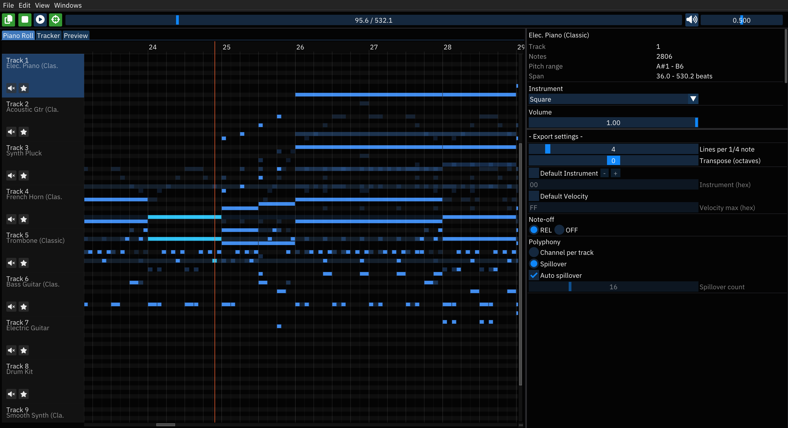

# midi2furnace



A desktop tool for converting MIDI files into [Furnace Tracker](https://github.com/tildearrow/furnace) pattern data. Open a MIDI, visualize it in a piano roll or live tracker view, configure export settings, and copy/export pattern data that pastes directly into Furnace’s pattern editor.

---

## Features

- **Piano roll** with zoom, pan, and marquee note selection
- **Live tracker view** that mirrors Furnace’s pattern grid in real-time
- **Clipboard export** in Furnace’s native pattern format (`org.tildearrow.furnace - Pattern Data (219)`)
- **File export** for saving pattern data to disk
- **Tempo-accurate playback** with square-wave synthesis
- **Per-track export overrides** for instrument, velocity, and spillover
- **Polyphony handling** — channel-per-track or automatic spillover across sub-channels
- **Configurable theme** with Furnace-style dark colors (editable via Settings)
- **Cross-platform** — runs on Linux, macOS, and Windows; pre-built binaries available

---

## Quick Start

1. **Open** a MIDI file: `File > Open` or `Ctrl+O`
2. **Navigate** the piano roll — zoom, pan, and explore your tracks
3. **Switch views** — use the Piano Roll, Tracker, or Preview tabs
4. **Configure export** — adjust lines per 1/4 note, instrument, velocity, polyphony, and note-off settings in the export panel
5. **Copy or export** — hit `Ctrl+C` or click the copy button to put pattern data on your clipboard, then paste into Furnace

---

## Controls

### Mouse

- **Middle or Right-drag**: pan
- **Wheel**: vertical scroll
- **Ctrl + Wheel**: horizontal zoom (time)
- **Shift + Wheel**: horizontal pan
- **Left-drag in roll**: marquee selection
- **Click in ruler**: move playhead

### Keyboard

- **Arrows**: pan (time / rows)
- **+ / -**: horizontal zoom
- **Shift + (+ / -)**: vertical track zoom
- **PgUp / PgDn**: note height zoom
- **Space**: play / stop
- **Esc**: clear selection, reset playhead
- **Ctrl+O**: open MIDI
- **Ctrl+C**: copy selection to Furnace format
- **Ctrl+Q**: quit
- **?**: toggle tips window

---

## Installation

### From source

```bash
pip install -r requirements.txt
python midi2fur.py
```

### Requirements

- Python 3.11+
- pygame >= 2.5.2
- PyOpenGL >= 3.1.6
- imgui[pygame] >= 2.0.0
- mido >= 1.2.10
- pyperclip >= 1.8.2

### Pre-built binaries

Download from [GitHub Releases](https://github.com/JoshuaMarkle/midi2furnace/releases) — available for Linux (x64), macOS (arm64), and Windows (x64).

---

## Building

```bash
# Local build
pyinstaller --noconfirm --workpath .pyibld --distpath dist build/midi2furnace.spec

# Run tests
pytest tests/ -v
```
